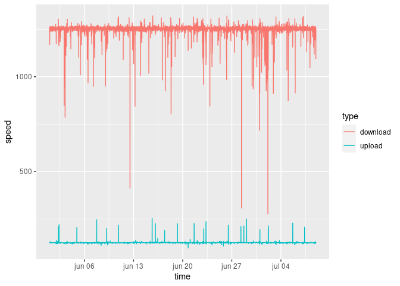
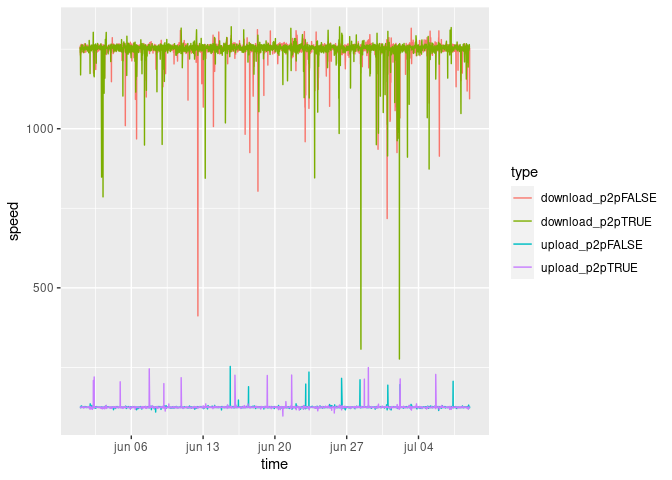
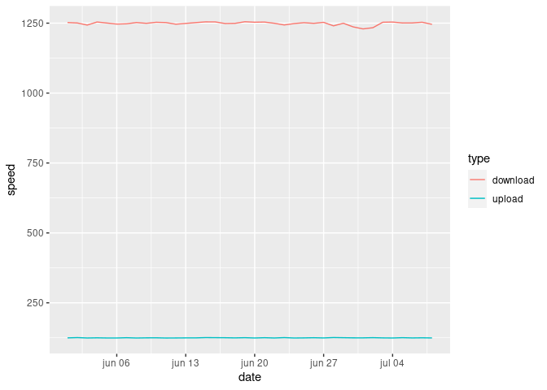
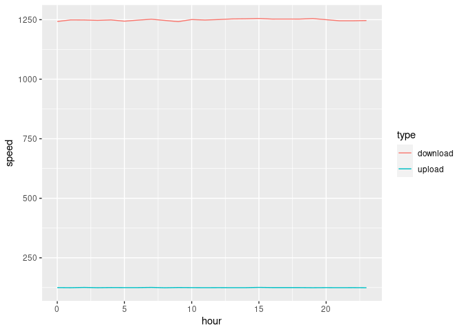
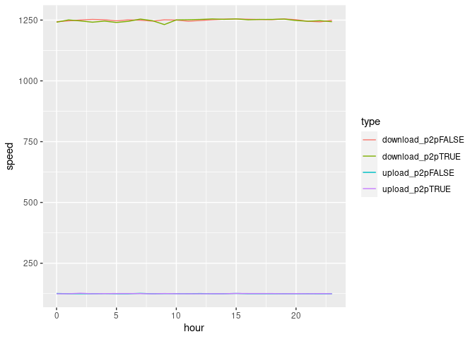

Network speed exploration
================

This project explores data collected every 10 minutes using [Ookla’s
Speedtest](https://www.speedtest.net/).  
Although the code in this repository allows to improve Ookla’s data with
date/time and p2p status -this means if the p2p application in the local
network is running or not- available data lacks these two variables.

For the purpose of developing this notebook, start date and time have
been chosen for the first observation, asigning date/time values for the
rest of the data with a 10min delay between one observation and the
next. Values for p2p status have been randomly generated.

## Speed

Here we can see the whole speed data along the whole period. It is
interesting to note that there is not much variability and also that
larger outliers occur in the range bewteen upload and download averages.

<!-- -->

## p2p status

We can split this data on the status (running or not running) of a p2p
application in the local network. In this case we are using random
generated statuses, but real patterns could be spotted on real data.

<!-- -->

# Daily means

If we average the data daily, we can see how outliers are smoothed,
showing there were no days with a clearly different speed.

<!-- -->

# Hourly means

Here we plot data hourly, showing no clear time at which speed
consistently changes.

<!-- -->

# Hourly means with p2p status

Split hourly data by p2p status. Here again, we may see some difference
if p2p data were not randomly generated.

<!-- -->
